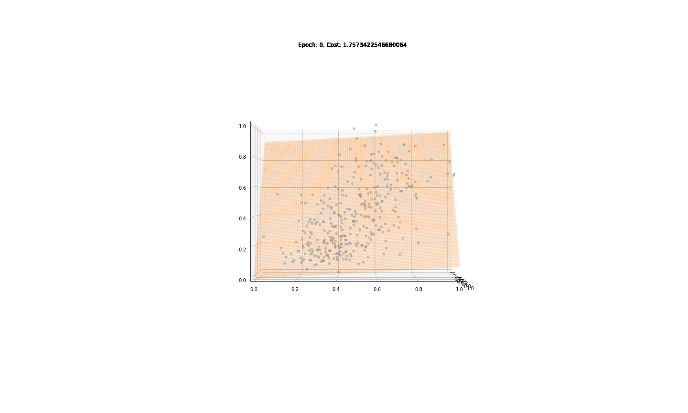
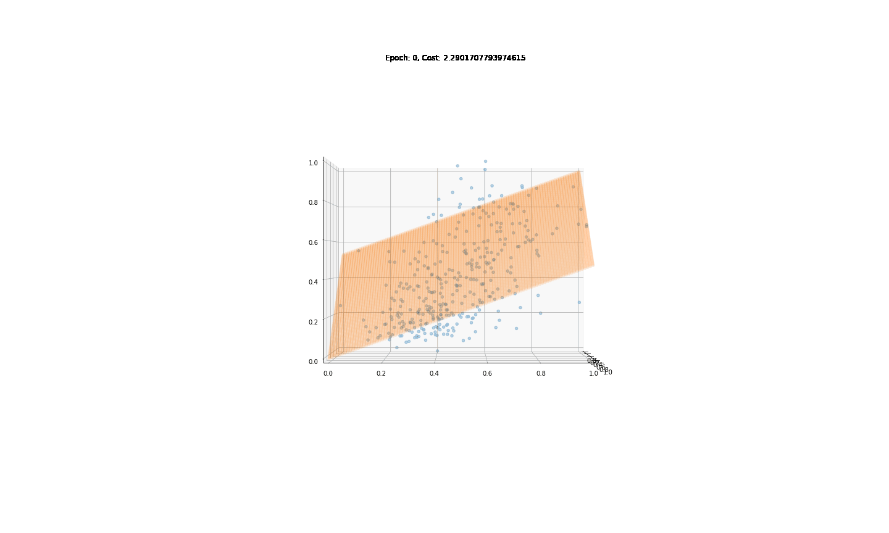
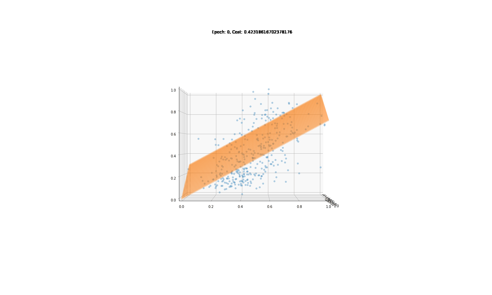

# Implementation of Batch, Stochastic and Minibatch Gradient Descent from Scratch for Diabetes Prediction
### Batch Gradient Descent

### Stochastic Gradient Descent

### Minibatch Stochastic Gradient Descent

### Final model and train, test sets

### Comparison of Performances in Diabetes Prediction Task (Linear Regression)
Tolerance was 0.03. Whenever MSE cost is <= 0.03, Gradient Descent stopped working. Here is the comparison of Batch, Stochastic and Minibatch Gradient Descent with tolerance = 0.03. Notice how many epochs each of the algorithms took to reach MSE <= tolerance. 
| GD variant | Number of epochs | FInal training cost |
| ---------- | ---------------- | ------------------- |
| Batch GD   | 2255             | 0.0299              |
| Stochastic GD | 11            | 0.0301              |
| Minibatch SGD | 106           | 0.0300              |
