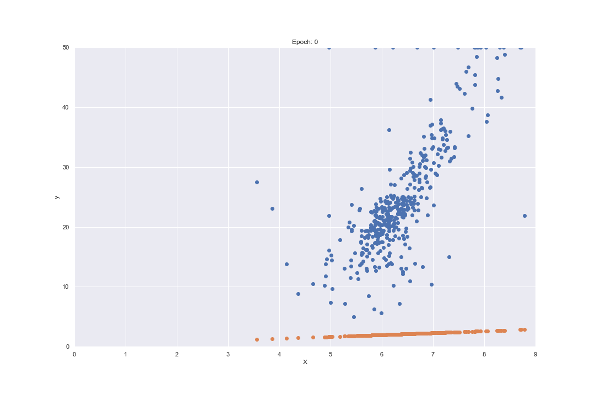
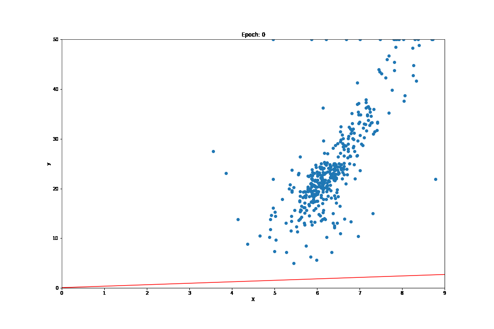
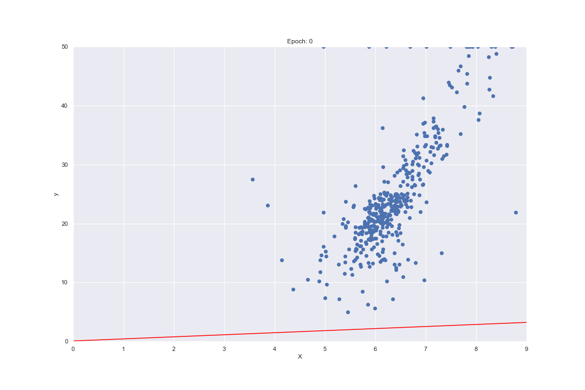

# Implementing Momentum, NAG, AdaGrad and RMSProp from Scratch
**Batch Gradient Descent**

**Stochastic Gradient Descent**

**Minibatch Stochastic Gradient Descent**

**Momentum Optimization**

**Nesterov Accelerated Gradient**

